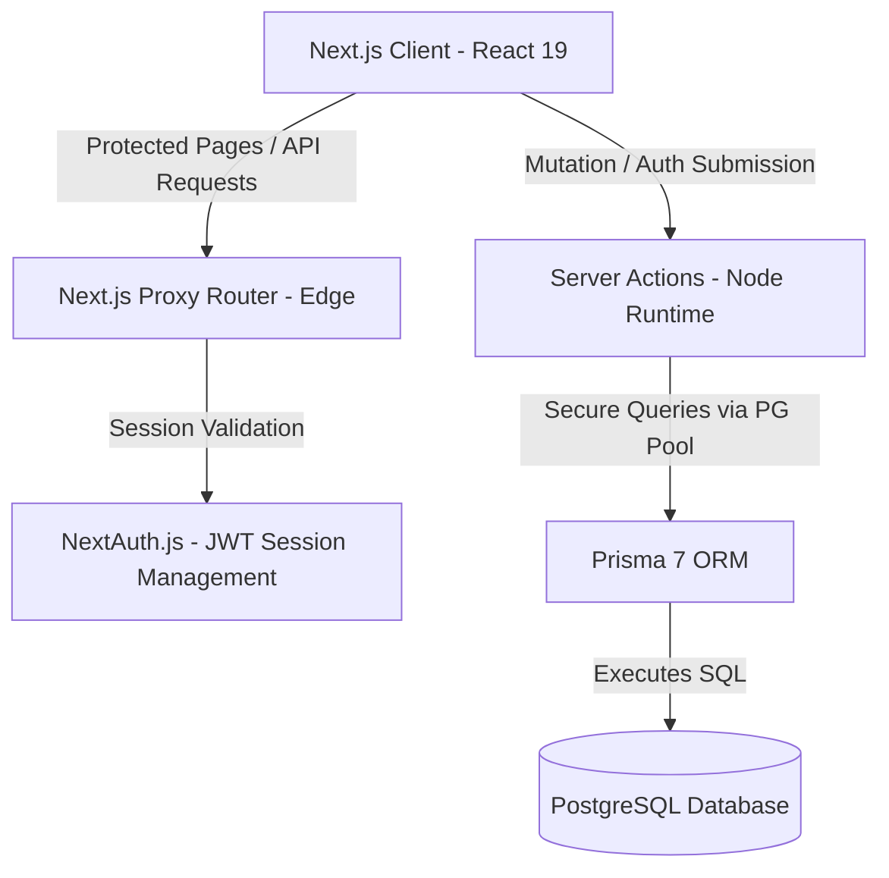
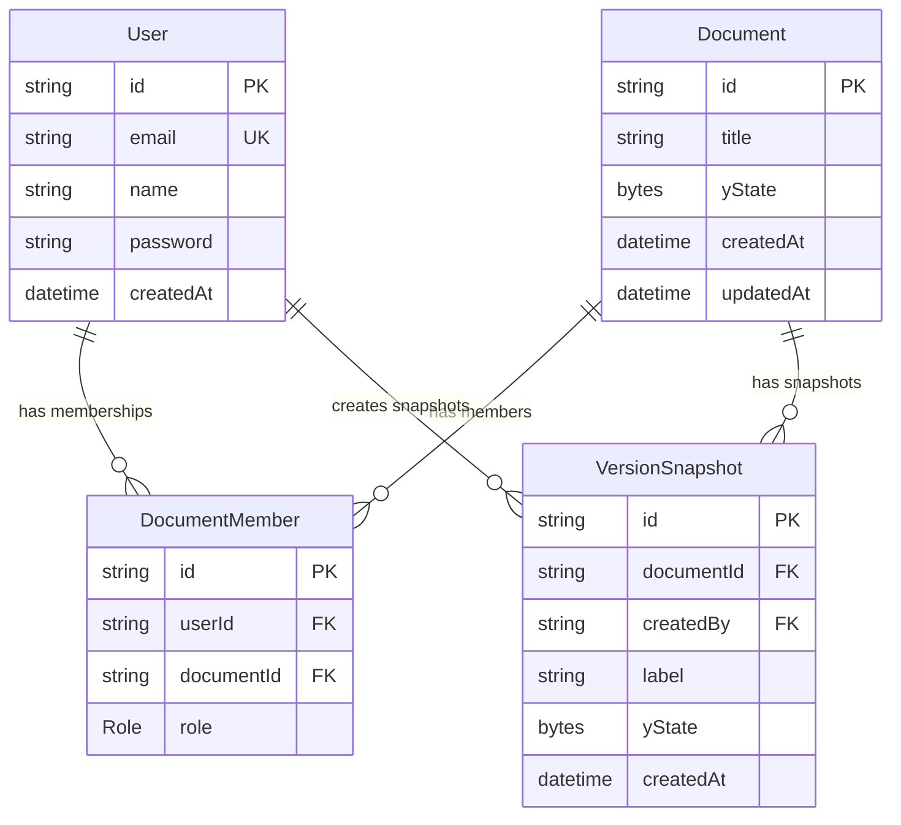

# EdtechDocs - Architecture & System Design (Phase 1 & 2)

This document provides a comprehensive overview of the design patterns, architectural layers, and technologies utilized in **EdtechDocs**, a local-first collaborative document editor.

---

## 🏛️ System Architecture

EdtechDocs is built as a fullstack application using Next.js 16, utilizing React Server Components (RSCs), Server Actions, and a decoupled local-first/cloud-sync database flow.



---

## 💾 Database Design & Relational Schema

We use PostgreSQL for cloud storage, managed via Prisma 7. The database model is designed to support multi-tenant collaborative environments with role-based access control (RBAC).



### 1. Models & Relations
- **User:** Stores credentials (hashed passwords) and tracks account creation.
- **Document:** Holds document metadata and the core binary representation of the Yjs document state (`yState`).
- **DocumentMember:** A junction table that resolves the many-to-many relationship between Users and Documents. It stores the role of the user on that specific document (e.g. `OWNER`, `EDITOR`, `VIEWER`).
- **VersionSnapshot:** Stores snapshots of Yjs documents at specific points in time. It references the creator and the document, keeping the historical Yjs state as a byte array (`yState`).

---

## 🔒 Security, Authentication, & Routing

### 1. JWT-Based Credentials Authentication
Authentication is implemented via **Auth.js v5 (NextAuth)**. We use a custom credentials provider:
- Passwords are encrypted using `bcryptjs` with 10 salt rounds before storage.
- On login, credentials are valid if the user exists and the password hash matches.
- Authenticated sessions are entirely JWT-based (stateless) to support rapid verification and high throughput.
- User IDs are appended to the JWT token and session object, allowing downstream routes to identify active users without redundant database queries.

### 2. Edge-Level Router Security (`proxy.ts`)
Next.js 16 introduces the `proxy.ts` convention to replace the older `middleware.ts` standard. 
- The proxy executes on the Edge runtime before any route is resolved or rendered.
- **Auth Guard:** The proxy inspects the request context and NextAuth JWT cookie. Unauthenticated access to dashboard routes (`/dashboard`, `/documents/*`) triggers an immediate redirect to `/login`.
- **Redirect loop prevention:** If an authenticated user tries to navigate to `/login` or `/register`, the proxy automatically intercepts the request and redirects them forward to `/dashboard`.

---

## ⚡ Technical Decisions & Upgrades

### 1. Prisma 7 Architecture
Prisma 7 introduces strict separation of environment-specific details from structural definitions:
- **`prisma.config.ts`:** Used as a typescript configuration layer to load the connection string dynamically from environment variables, preventing connection leakage in the `schema.prisma`.
- **Postgres Driver Adapter:** Prisma Client runs via the `@prisma/adapter-pg` driver adapter using a Node-native connection Pool. This configuration manages connection pooling effectively, ensuring optimized reuse of database sockets under heavy API load.

### 2. Modern UI, Base UI, & Design Tokens
For our design system, we utilize Tailwind CSS v4 configured with brand-specific design tokens alongside Shadcn components built with `@base-ui/react`:
- **Color Palettes:** Map exact hex tokens for UI elements: Primary (`#6366F1`), Secondary (`#10B981`), Tertiary (`#0F172A`), and Neutral (`#F8FAFC`).
- **Typography Engine:** Next.js loads and injects `Inter` for headers/body fonts and `JetBrains Mono` for input labels (`font-label`).
- **Render-Based Triggering:** We utilize Base UI's `render` prop composition model (e.g. `<DialogTrigger render={<Button ... />} />`) rather than the older Radix-style `asChild` composition, ensuring clean React 19 node trees.
- **Group Context Enforcement:** In accordance with Base UI constraints, menu parts such as `DropdownMenuLabel` are securely nested inside `<DropdownMenuGroup>` to ensure proper accessibility and context alignment.
- **Transition Smoothness:** Optimized Dialog and Dropdown Menu opening animations to `duration-200` to prevent laggy rendering.

---

## 📝 Phase 2: Core Editor Architecture

Phase 2 introduces the collaborative rich-text editor engine utilizing TipTap (an extensible wrapper around ProseMirror) and links it directly with PostgreSQL persistence via secure, role-based Server Actions.

```mermaid
graph TD
    Page[src/app/documents/[id]/page.tsx - Server Component]
    ActionGet[getDocumentWithRole Server Action]
    ActionSave[updateDocumentContent Server Action]
    ClientEditor[src/components/editor/EditorContainer.tsx - Client Component]
    TipTap[TipTap Editor Instance]
    Postgres[(PostgreSQL)]

    Page -->|1. Fetch Session & Member Role| ActionGet
    ActionGet -->|Query Membership| Postgres
    Page -->|2. Render Container with Initial Content & Role| ClientEditor
    ClientEditor -->|3. Instantiate TipTap| TipTap
    TipTap -->|4a. Debounced Keypress 1.2s| ActionSave
    TipTap -->|4b. On Blur Event Immediate| ActionSave
    ActionSave -->|5. Validate RBAC Owner/Editor| Postgres
```

### 1. Database Schema Extension
We added a `content` field to the `Document` schema:
* `content String? @default("")`: Stores the document's rich-text representation as standard HTML string.

### 2. Role-Based Access Control (RBAC) & Editor Canvas Modes
Access validation is enforced at the Server Action level and reflected in the UI:
* **Server Action Enforcement (`updateDocumentContent`):** Checks membership in the junction table `DocumentMember`. Only users with `OWNER` or `EDITOR` roles are allowed to commit changes. Requests from `VIEWER` or non-members are rejected.
* **UI Customization:**
  * For **OWNER** or **EDITOR** roles, the editor instance is fully interactive. Custom toolbar commands (Bold, Italic, lists, headings) are rendered and active.
  * For the **VIEWER** role, the toolbar is hidden, the canvas is set to `editable: false`, and an alert banner is displayed: `Viewing Mode — Document is read-only`.

### 3. Synchronous Client-to-Cloud Saving Strategy
The TipTap client handles persistence automatically through two actions:
1. **Debounced saving (onUpdate):** Keystrokes invoke a timer that triggers after a `1200ms` typing pause. This limits database write load while ensuring work is saved automatically during active writing.
2. **Immediate saving (onBlur):** When the editor canvas loses focus (blur event), any pending debounced timers are cleared, and the content is saved immediately to PostgreSQL.

### 4. Next.js 16 Dynamic Routing and Param Resolution
Next.js 16 requires dynamic route params to be treated as Promises. The route `/documents/[id]/page.tsx` resolves params asynchronously:
```typescript
interface DocumentPageProps {
  params: Promise<{ id: string }>
}
export default async function DocumentPage({ params }: DocumentPageProps) {
  const { id } = await params;
  // Fetch document metadata and membership role...
}
```
This protects dynamic document routes at the server level, redirecting unauthenticated or unauthorized users back to the login or dashboard pages.

### 5. Collaborative Sharing and Access Management (RBAC Flow)
To allow document sharing and access delegation, we implemented the following security flow:
- **Caller Role Validation:** Server Actions (`inviteUserToDocument`, `updateMemberRole`, `removeMember`) fetch the current user's session and query the `DocumentMember` table to verify they are the `OWNER` of the document. If not, the actions fail immediately with an unauthorized error.
- **Lookup Validation:** The `inviteUserToDocument` action resolves the target user's email to verify their registered account exists, preventing invitations to non-existent users. It also verifies that they are not already associated with the document.
- **Component-Level Role Customization (`ShareDialog.tsx`):**
  - Current document members with any role can trigger the dialog to view the list of active collaborators.
  - Only document owners see the **Invite Form** (email field and role select dropdown) and **Management Controls** (dropdown selects to swap collaborator roles between `EDITOR`/`VIEWER` and revocation buttons to delete memberships).
  - Member listings automatically display a customized, themed badge based on their role (`OWNER` in Indigo, `EDITOR` in Emerald, `VIEWER` in Slate).
