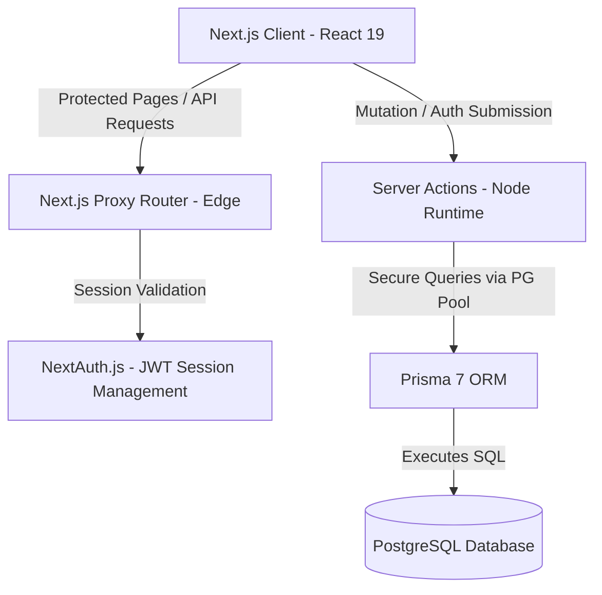
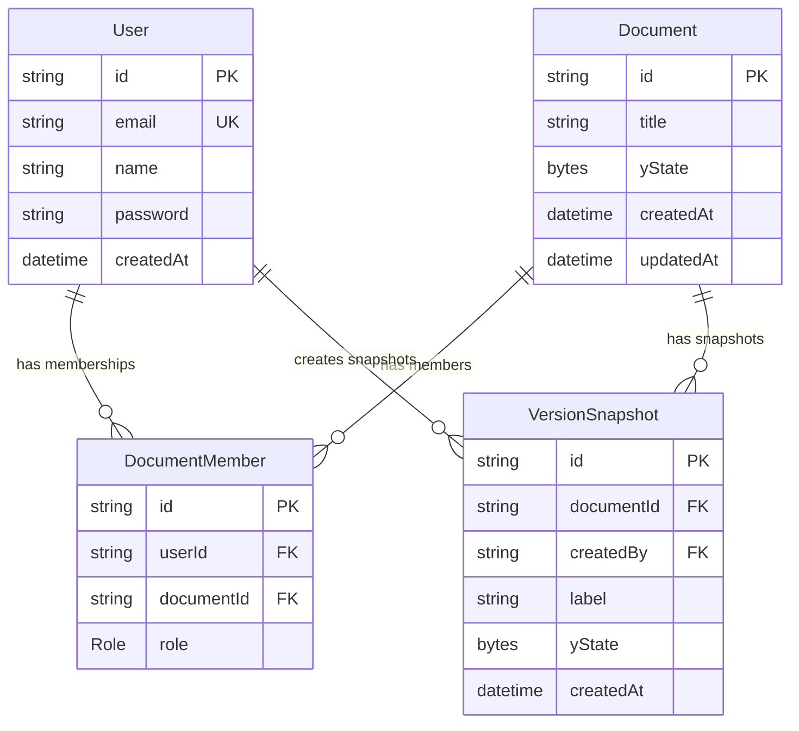

# EdtechDocs - Architecture & System Design (Phase 1)

This document provides a comprehensive overview of the design patterns, architectural layers, and technologies utilized in **EdtechDocs**, a local-first collaborative document editor.

---

## 🏛️ System Architecture

EdtechDocs is built as a fullstack application using Next.js 16, utilizing React Server Components (RSCs), Server Actions, and a decoupled local-first/cloud-sync database flow.

---

## 💾 Database Design & Relational Schema

We use PostgreSQL for cloud storage, managed via Prisma 7. The database model is designed to support multi-tenant collaborative environments with role-based access control (RBAC).

### 1. Models & Relations
- **User:** Stores credentials (hashed passwords) and tracks account creation.
- **Document:** Holds document metadata and the core binary representation of the Yjs document state (`yState`).
- **DocumentMember:** A junction table that resolves the many-to-many relationship between Users and Documents. It stores the role of the user on that specific document (e.g. `OWNER`, `EDITOR`, `VIEWER`).
- **VersionSnapshot:** Stores snapshots of Yjs documents at specific points in time. It references the creator and the document, keeping the historical Yjs state as a byte array (`yState`).

---

## 🔒 Security, Authentication, & Routing

### 1. JWT-Based Credentials Authentication
Authentication is implemented via **Auth.js v5 (NextAuth)**. We use a custom credentials provider:
- Passwords are encrypted using `bcryptjs` with 10 salt rounds before storage.
- On login, credentials are valid if the user exists and the password hash matches.
- Authenticated sessions are entirely JWT-based (stateless) to support rapid verification and high throughput.
- User IDs are appended to the JWT token and session object, allowing downstream routes to identify active users without redundant database queries.

### 2. Edge-Level Router Security (`proxy.ts`)
Next.js 16 introduces the `proxy.ts` convention to replace the older `middleware.ts` standard. 
- The proxy executes on the Edge runtime before any route is resolved or rendered.
- **Auth Guard:** The proxy inspects the request context and NextAuth JWT cookie. Unauthenticated access to dashboard routes (`/dashboard`, `/documents/*`) triggers an immediate redirect to `/login`.
- **Redirect loop prevention:** If an authenticated user tries to navigate to `/login` or `/register`, the proxy automatically intercepts the request and redirects them forward to `/dashboard`.

---

## ⚡ Technical Decisions & Upgrades

### 1. Prisma 7 Architecture
Prisma 7 introduces strict separation of environment-specific details from structural definitions:
- **`prisma.config.ts`:** Used as a typescript configuration layer to load the connection string dynamically from environment variables, preventing connection leakage in the `schema.prisma`.
- **Postgres Driver Adapter:** Prisma Client runs via the `@prisma/adapter-pg` driver adapter using a Node-native connection Pool. This configuration manages connection pooling effectively, ensuring optimized reuse of database sockets under heavy API load.

### 2. Modern UI & Base UI Integration
For our design system, we utilize Tailwind CSS v4 alongside Shadcn components built with `@base-ui/react`:
- **Render-Based Triggering:** We utilize Base UI's `render` prop composition model (e.g. `<DialogTrigger render={<Button ... />} />`) rather than the older Radix-style `asChild` composition, ensuring clean React 19 node trees.
- **Group Context Enforcement:** In accordance with Base UI constraints, menu parts such as `DropdownMenuLabel` are securely nested inside `<DropdownMenuGroup>` to ensure proper accessibility and context alignment.
